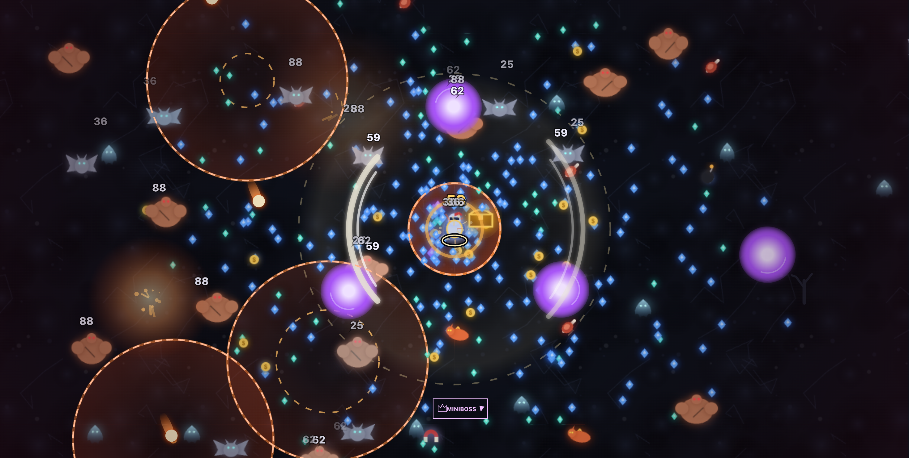

# Playtest difficulty update — 0.4.0

September 29, 2026. Implements the owner's reports of stationary survival, low boss health, invisible drops at pickup saturation, excessive evolution coverage, easy rituals and a complete build around minute 17. This is the next local playtest candidate, not a claim of finished balance or YouTube certification.

## Changes mapped to the playtest

| Feedback | Implemented response |
| --- | --- |
| Multiply boss health by four | All twelve mini-boss and six main-boss health values are exactly 4× their 0.3.0 values. Korgath is now 2,800 HP, Varkos 13,600, Maltheor 30,000 and Death 104,000. Later encounters continue increasing in health. |
| Enemies die too quickly as the hunt advances | Ordinary spawn health multiplier is `1 + .22m + (m/10)^2`, with `m` clamped to 0–30 minutes: 2.35× at 5, 4.2× at 10, 6.55× at 15, 9.4× at 20 and 16.6× at 30. A minute-15 brute has about 622 HP, so a 225-damage hit no longer kills it. Already living ordinary enemies retain their spawn-time HP. |
| More varied enemies and movement pressure | One ordinary type first enters every two minutes through minute 28, with 3–5-type mixtures from minute 4. Cultist bolts start at 4; wraith ground attacks, charging hounds/lancers and later fans add different dodge demands. Brute speed rises from 36 to 62. |
| Drops appear to stop | The old full-pool rule put XP into a random existing gem, so new kills visibly dropped nothing. Now a distant old pickup is consolidated into its nearest matching pickup, freeing a slot for new loot at the actual kill position. XP and gold totals are preserved. Full pools of non-XP items also consolidate into bounded stacks; deferred rewards are grouped by kind. The sprite pool remains bounded for performance; there is no fixed total field-XP ceiling. |
| Meteor Storm covers too much ground | Base impact radius 95→52, about 45% smaller radius / 70% smaller area at the same modifiers. Damage multiplier 1.9→1.4. Warning and damage geometry match. |
| Void Sphere is enormous and pulls | Evolved size multiplier 2.1→1.2, about 43% smaller radius / 67% smaller area. Damage multiplier 1.5→1.2. Pulling code is removed and orb AOE is zero, including migrated projectiles. |
| Too many evolutions / damage spikes | One evolution per hunt is enforced in chest eligibility, choice validation, restored drafts and HUD guidance. Other evolution damage bonuses are reduced; evolved cast cooldown multiplier changes from .8 to .9. Ordinary weapon rank damage is unchanged, avoiding a hidden damage penalty. |
| Full build too early | First twelve level costs stay unchanged; later XP costs rise smoothly. Ordinary chests grant one equipment rank plus gold. Numerical level remains uncapped; the measured target is completing six weapons and six passives, totaling 78 equipment ranks. |
| Ritual is trivial and over-rewarding | 60 kills instead of 12; both hunter and kill must be within radius 220 instead of 300. Survive at least 30 seconds within a 45-second deadline. Mixed reinforcements arrive every six seconds, with additional warned ground attacks. Damage blessings fall from 20% to 10%; meat protection falls from 1s to .5s. |

Enemy introduction order: Night Bat 0, Ghoul 2, Cultist 4, Skeleton 6, Crypt Spider 8, Flesh Brute 10, Wraith 12, Hellhound 14, Gargoyle 16, Pit Demon 18, Bone Golem 20, Shadow Fiend 22, **Dread Lancer 24**, **Crimson Banshee 26**, **Iron Scarab 28**. The three additions have distinct procedural silhouettes, palettes and combat roles. Named mini-boss/ritual summons are separate from the ordinary introduction schedule.

Enemy attacks commit to visible warnings, cancel when the owner dies or is frozen, and are capped to prevent an unreadable volley wall. Active warnings are preserved when cosmetic effects fill the effect pool; an attack defers if its full warning cannot be shown. The existing boss queue, dawn sweep and Death-only victory rules remain.

## Progression calibration

An initial stronger XP curve left a partial-progression Ranger with only 65/78 equipment ranks at dawn. Its long main fights admitted fewer elite chests than assumed. The final curve was reduced to preserve slower growth without pushing the full build far beyond thirty minutes.

The final seed-1 Ranger probe used legal upgrades, normal weapon damage, two permanent ranks where available, and **huge HP solely to keep the progression measurement running**. It declined rituals and used no time skips. Results:

| Run minute | Level | Equipment ranks / 78 |
| ---: | ---: | ---: |
| 10 | 31 | 35 |
| 15 | 39 | 43 |
| 17 | 44 | 48 |
| 25 | 60 | 65 |
| 27 | 64 | 69 |
| 28 | 67 | 72 |
| 29 | 70 | 76 |
| 30 | 71 | 77 |

The build completed at **30:01.52**. This is close to the requested 27–30-minute target in one assisted measurement; it does not guarantee that timing for every hunter, upgrade order or player. It also does not prove a normal win. [Raw progression evidence](evidence/difficulty-v040-progression.jsonl).

## Normal combat diagnostics

Eight legal-build, normal-health seed-1 cases finished within the 120-CPU/180-wall-second ceiling. No invulnerability or time skips were used.

| Hunter | Fresh profile | Partial profile |
| --- | --- | --- |
| Knight | Defeat 00:32, Night Bat | Alive at 31:00 horizon; finale unfinished |
| Ranger | Defeat 23:27, Wraith | Defeat 15:12, Maltheor projectile |
| Mage | Defeat 08:59, Webmaw | Defeat 23:03, Shadow Fiend projectile |
| Reaper | Defeat 07:18, Cultist projectile | Defeat 12:17, Cultist projectile |

These runs demonstrate substantially greater pressure, **not successful all-hunter balancing**. The early Knight death is an explicit next-playtest concern. Different random upgrade paths can make a partial-profile bot perform worse than a fresh one. The bot's greedy movement and instant choices do not model human skill. [Raw moving-bot evidence](evidence/difficulty-v040-moving.jsonl).

Twelve controlled stationary/orbit fixtures also ran on both the committed 0.3.0 source and the candidate using identical legal equipment, normal HP and a fixed progression bar. All fixtures died in both versions; they do not reproduce the owner's exact permanent ranks or multi-evolution build. In the candidate, stationary cases died within roughly 8–22 seconds; an unthinking small orbit did not consistently survive either. This checks that those fixed builds cannot ignore pressure, but does not prove that skilled dodging is fair. [Baseline fixtures](evidence/difficulty-pressure-v030.jsonl), [candidate fixtures](evidence/difficulty-pressure-v040.jsonl).

The earlier incomplete fixture attempts stopped on a missing Clover evolution partner; the fixture was corrected and validated before both final batches. Those aborted attempts remain scratch output and are not counted. No tests or win rates from 0.2.x/0.3.0 are presented as current balance evidence.

## Correctness and browser verification

- **169 regular tests pass**, zero failures; the optional long fixture is skipped only in the regular command. Twenty-six new tests cover health/content schedules, ranged warnings, saturation/conservation/stacking, ritual rules, single evolution, weapon geometry and migration. [Test output](evidence/difficulty-v040-tests.tap).
- The separate assisted full director fixture passed at 30:09.75: all 18 bosses defeated, 14 elites and 7 swarms delivered, periodic checkpoints restored, sampled peak snapshot 43,812 bytes. It uses huge HP/damage and one evolution to isolate scheduling; it is not a normal victory. [Long-run output](evidence/difficulty-v040-long.tap).
- Typecheck, lint, website/standalone/Playables/QA builds and archive validation pass. The last change after the test suite was ritual-screen text selection; typecheck, lint and all builds were rerun for that fix.
- Chrome QA at 1470×742 CSS pixels / DPR 2 showed the one-evolution choice, the new Meteor Storm description, the smaller active impacts, mixed enemies, ritual acceptance/progress and reduced blessing choices. A stale ritual intro on the reward screen was found and corrected; the final rebuilt artifact was reloaded and the completed ritual showed the corrected completion message. These forced max-equipment/invulnerable scenarios establish UI transitions, not natural balance.



This is an actual canvas export from the isolated QA hunt, with max equipment and only Meteor Storm evolved. It excludes the DOM HUD/menus. It predates only the final ritual reward-text correction; combat source is the same. It is not a natural level-80-at-minute-17 result.

## Saves, artifacts and next playtest

Engine snapshots are version 3; profile schema 2 and the active-run wrapper are unchanged. Migration preserves permanent purchases/currency, XP-bar fraction, first earned evolution and main/mini health percentages. Extra old evolutions return to ordinary maximum rank; historical credit stays. See [save compatibility](save-policy.md). Start a **fresh hunt**, keeping your existing permanent upgrades, to assess the new progression curve.

| Artifact | Bytes | SHA-256 |
| --- | ---: | --- |
| `game.html` | 431,385 | `5024b413b28258f2165f6fab2806026fba1421a2f70e1b745f150038205126a1` |
| Playables ZIP | 136,720 | `d7ab0a8d46d43df258c4a9c5cce03ae0aa592aa7692ce1ec199eb594d5cac6e2` |
| Isolated QA HTML | 635,837 | `c23e1f9da24aa8b7e6cf424c26fdb37492ed2c5363435b5a939ceaf592fa8265` |

The ZIP contains five files / 434,588 bytes uncompressed. It passes SDK-first and relative-asset checks. No dependency changes or fresh-install reproducibility claim are made for this version. Nothing was uploaded or deployed.

Next human checks: first three minutes with each hunter, movement pressure at 5/10/15/20, first evolution timing, boss duration, ritual completion without invulnerability, fresh-drop visibility in a saturated field, and the minute when equipment finishes. Record hunter and permanent ranks with the next report. Android/iPhone and actual YouTube tests remain on [the release checklist](release-checklist.md).

Reproduce the principal probes:

```sh
BALANCE_SEEDS=1 BALANCE_PROFILES=fresh,partial BALANCE_CPU_BUDGET=120 BALANCE_WALL_BUDGET=180 node --import tsx scripts/simulate-balance.ts
BALANCE_HUNTERS=ranger BALANCE_PROFILES=partial BALANCE_SEEDS=1 BALANCE_SURVIVAL_ASSIST=1 BALANCE_CPU_BUDGET=100 BALANCE_WALL_BUDGET=150 node --import tsx scripts/simulate-balance.ts
PRESSURE_VARIANTS=meteor,void node --import tsx scripts/diagnose-pressure.ts
RUN_LONG=1 node --import tsx --test tests/engine.long.test.ts
```
