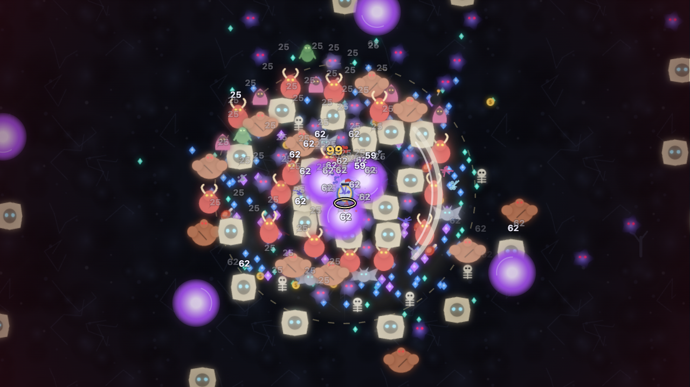

# Candidate 0.2.1 verification — September 29, 2026

Status: **built local candidate with passing automated gates and selected real-browser checks**. Not deployed, submitted or YouTube-certified. The owner has Android and iPhone but no physical results or Playables Developer Portal access yet. This record supersedes September 28 artifact measurements; that earlier record remains historical evidence.

## Final automated results

| Check | Result |
| --- | --- |
| `npm run typecheck` | Pass. |
| `npm run lint` | Pass. |
| `npm test` | **126 pass, 0 fail, 1 optional long fixture skipped**; 127 registered tests. |
| Separate long fixture | `RUN_LONG=1 node --import tsx --test tests/engine.long.test.ts` passed after the engine corrections: 1,815 simulated seconds, explicitly assisted, all 14 elites / 7 swarms / 3 bosses. Final render-only changes were covered by the later aggregate suite. |
| `npm run build:all` | Static Next website, standalone and Playables builds pass. |
| `npm run validate:playables` | Pass: 5 files, 412,928 bytes uncompressed, SDK first and relative assets valid. |
| `npm run build:qa` | Pass, separate ignored `qa-output/browser/index.html`; not included in production builds or ZIP. |
| Production QA exclusion | Standalone and Playables JavaScript contain none of the QA launch, frame diagnostics or capture UI labels. Production engine regression rejects debug scenarios even with a changed public flag. |
| Independent reproduction | Fresh `npm ci`, clean standalone/ZIP/manifest byte comparisons and alternate-time-zone ZIP rebuild pass. See [full method](reproducibility-2026-09-29.md). |
| Patch hygiene | `git diff --check` passes. No dependency versions changed; package version is 0.2.1. |

Regular test breakdown: 50 engine, 34 save, 16 platform, 4 audio, 6 input, 8 render, 2 package, 3 content, 2 recovery-lab and 1 preview-server test. Regression coverage verifies behavior and failure boundaries; it does not establish subjective fun, every possible build, or mobile certification.

| Final artifact | Bytes | SHA-256 |
| --- | ---: | --- |
| `game.html` | 409,725 | `2977552319c48664b3e994a69f5569f889fb09800c1aa1cdcd859bb7de236f39` |
| `dist/nightfall-survivors-playables.zip` | 130,201 | `9e944a8e30d39b12ecaf9087db2b72666afaeac212cea4668e9f8e70b14ab8c6` |

`dist/playables-manifest.json` contains every packaged file's size and checksum. Website output is `out/`. The QA build uses development React and in-memory progress; it is not the release artifact.

## Actual Chrome observations

The storage lab serves a copy of the generated standalone with a namespaced storage adapter, so no ordinary player save is used for corruption/failure scenarios. It is not a fake YouTube SDK or a cloud-certification test. Broader recovery checks used the earlier same-day 0.2.1 HTML (`dc72e8949411d19d59f9271c83e927135e2e356bc84d386c47fd5de339417d27`); only the final hit-flash/hunter-outline renderer change separates that artifact from the final one above. The narrower final-artifact retest is identified separately.

| Target / scenario | Observed result |
| --- | --- |
| Corrupt primary + valid backup, writes blocked | Progress-attention screen offered explicit backup replacement. Failed recovery reported the error and preserved both original bytes and backup. Allow writes → retry replacement → 1,234 gold / saved status. |
| Future version 999 + older backup | Update/incompatibility message and Retry only. No backup downgrade/replacement action; future 4,321-gold payload retained. |
| Blocked primary read | Retry only, with no misleading backup action. Allow reads → Retry → original 1,000 gold. |
| Blocked write during shop purchase | Might purchase displayed 1,000→850 gold, rank 0→1 and a visible pending-save error. Allow writes → Retry → saved status; reload retained 850 gold and rank 1. |
| Keyboard recovery focus, 320×568 | Shift-Tab from the first shop action reached Retry; Tab wrapped back to the first action. A lab-only overlay initially intercepted pointer input, so this first retry was activated with Enter. The overlay was removed from the harness, not hidden by a game workaround. |
| Another writer | Separate fixture wrote 2,222 gold / revision 50. A stale purchase triggered Reload saved progress, with explicit unsaved-change confirmation. Reload latest → 2,222 gold; stale local data did not replace it. |
| **Final standalone, 320×568, overlay-free harness** | Repeated blocked-save Might purchase, 1,000→850, with the final SHA above. After allowing writes, clicked the actual visible **Retry save** button successfully. Saved status appeared; reload displayed **850 gold / Progress saved**. |
| **Final website** | Reload offered the existing unfinished hunt; Resume restored the paused **00:08 / level 1 / 0 earned gold** screen. Background HUD controls were absent from the dialog accessibility tree as intended. |
| Baseline website, 768×1024 | Menu/settings reachable with no horizontal document overflow; keyboard Shift-Tab reached Done and Enter returned to menu. This observation preceded the final UI rebuild and is retained as baseline evidence. |
| Baseline website, 1920×540 and 320×1138 | Wide/short settings used scrolling with reachable footer; very tall portrait retained the paused hunt and all pause actions. Not a complete final-build screen/input matrix. |
| **Final QA renderer, 1280×720** | Aldric, minute 27, seed 42, 300 initial enemies, six max-rank weapons/passives, invulnerability explicitly enabled. Scene reached the level-81 draft; actual battlefield PNG downloaded and inspected. Enemy colors/silhouettes remain under hit feedback, and the hunter locator's dark outline is visible over bright orbs. |

Intermittent browser-control connection/command timeouts occurred during the final expanded viewport check. Some timed-out actions had applied and were resolved by reading the next visible state; unobserved actions are not counted as passes. The complete final 768×1024 / 1920×1080 / wide-short and input matrix remains open. Browser timeouts are not evidence of a game crash. Temporary viewport cleanup was attempted; the final tool reported a detached lab tab. Test tabs remain eligible for automatic tool cleanup.

The existing user-owned Next development server was left untouched. A separate development QA bundle allowed scenario testing without restarting that server or weakening development-origin checks. Direct `file:` standalone opening remains manual after the prior browser security block; no bypass was attempted.

## Dense rendering and performance evidence

The [earlier captured frame](evidence/qa-battlefield-2026-09-29.png) revealed excessive white hit sprites. It prompted a bounded render change: draw normal/frozen artwork first, blend white feedback at 0.28 alpha, then use a dark-backed hunter locator. A focused regression checks paint order, bounded alpha, comfort suppression and unchanged simulation state.

The final image below is actual canvas output, not generated promotional art. It intentionally excludes the DOM HUD, draft and QA controls. This forced scene is not a naturally progressed hunt, and its capture is not a portal-ready screenshot or a pixel-matched before/after benchmark.

Final browser sample: **227 frame intervals**, 1280×720 CSS pixels, DPR 1; **52.6 average FPS, p50 16.7ms, p95 17.7ms, p99 33.5ms**. At the frozen draft boundary there were 122 enemies, 9 projectiles, 188 pickups, 111 particles and 1 effect. QA controls were closed during most of the burst and opened to read the final values. The sample covers roughly four seconds of an artificial initial density burst in development mode, on a shared desktop host. It is not sustained release FPS, a controlled comparative benchmark or mobile performance certification.

The [engine/balance audit](balance-audit-sept29.md) separately records 24 complete bot cases (22 victories, two early Reaper defeats) and bounded Node CPU/heap/snapshot diagnostics. Its dense mean/p95 simulation tick was 0.7821/1.4695ms at 120Hz, excluding rendering/UI/transport. Neither set of measurements establishes sustained heap, heat or battery behavior. Winning bot levels 183–213 and the two Reaper deaths remain human pacing/fairness targets.

## Remaining release work

- Follow [the Android/iPhone guide](phone-playtest.md), record exact models/OS/browser, and perform natural runs, touch/orientation/interruption/audio/save checks, repeated retries and thermal profiling.
- Review early Reaper control, late surplus-draft frequency, alternative builds, boss warning escape routes, Covenant optionality and purchase pacing with human playtests.
- Finish the remaining final-build browser/keyboard/touch/zoom/assistive-technology/listening matrix and standalone direct-file check. The [UI audit](ui-audit-2026-09-29.md) measures CSS contrast but does not claim complete accessibility certification.
- Obtain Playables portal access and verify actual cloud/lifecycle/mute/network behavior in Dev Link/test suite; then prepare exact portal assets and owner/rights metadata. Local SDK preview is not official verification.

The [living plan](../plan.md), [release checklist](release-checklist.md), [known limitations](known-issues.md), [save audit](save-recovery-audit-2026-09-29.md) and [changelog](../CHANGELOG.md) retain the distinction between implemented behavior and evidence still required.
